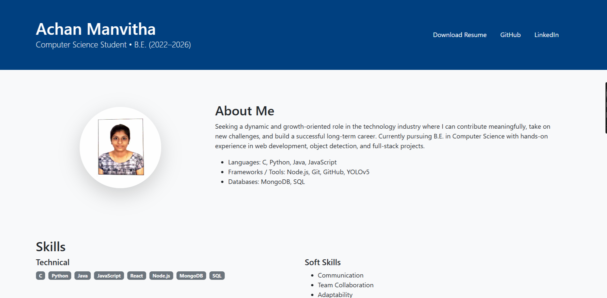

# 🌐 My Portfolio  

This is my personal portfolio website built with **React.js** 🚀  

👉 **Live Demo**: [Click here to view](https://Manvitha0704.github.io)  

---

## 📸 Preview  
   

---

## 📌 Features  
- Fully responsive design 📱💻  
- Modern React UI with reusable components ⚛️  
- Smooth navigation & interactive sections ✨  
- Showcases **Projects, Skills, and Contact Information**  

---

## 🛠️ Tech Stack  
- **Frontend**: React.js, JavaScript, HTML, CSS  
- **Hosting**: GitHub Pages  

---

## 📦 Installation (for Developers)  
If you’d like to run this locally:  

```bash
git clone https://github.com/Manvitha0704/Manvitha0704.github.io.git
cd Manvitha0704.github.io
npm install
npm start
